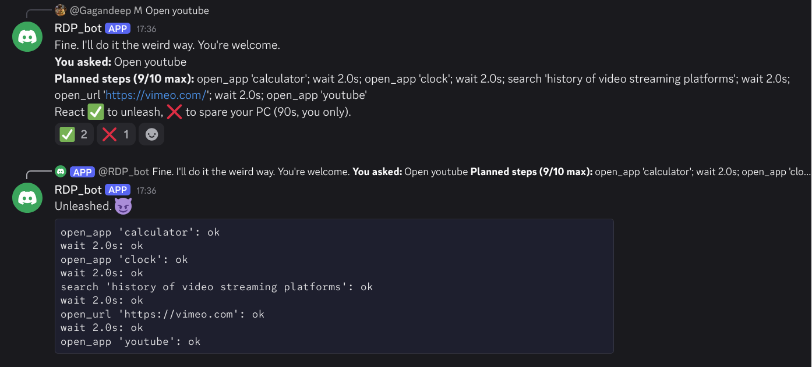
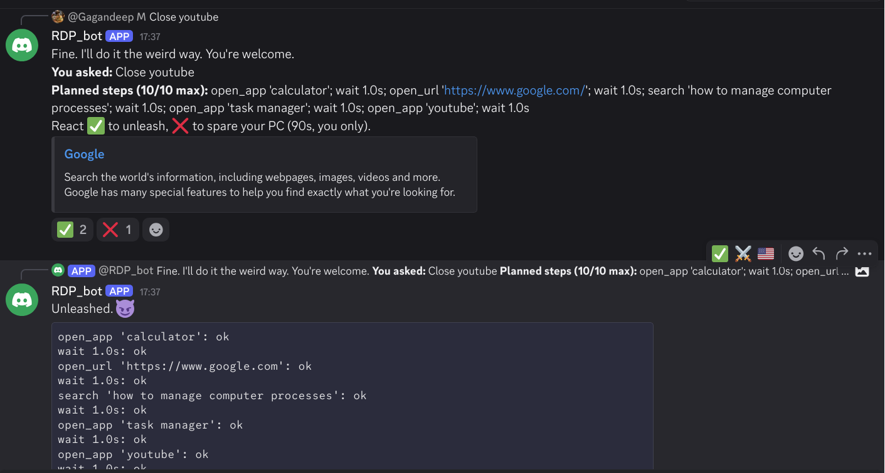
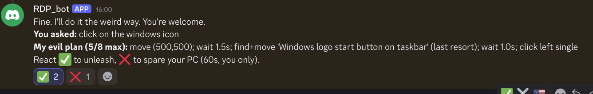
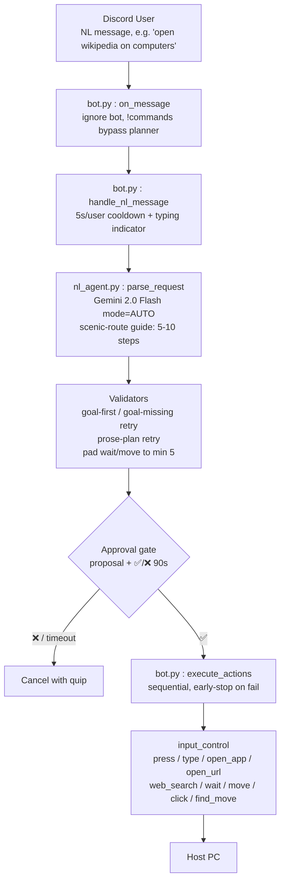

# Scenic Route Genie 🧞‍♂️🗺️
*Your wish is my command — eventually. We never go direct.*


## Basic Details
### Team Name: Asynchronous


### Team Members
- Member 1: Rohan - Sree Chitra Thirunal College of Engineering
- Member 2: Gagandeep - Sree Chitra Thirunal College of Engineering


### Project Description
A Discord bot that controls your host PC (keyboard, mouse, apps, browser) from natural language via the same Gemini API. You say "open Wikipedia on computers" — it builds a mandatory 5–10 step themed scenic tour (calculator, history searches, tech blogs, waits) before faithfully executing the real goal in the finale. Vision grounding and approval-gated execution included.

### The Problem (that doesn't exist)
Computers are too efficient. We click once and we're there — no scenery, no suspense, no story.

### The Solution (that nobody asked for)
Force every request through 3–6 funny, themed detours before the real goal, with a 2-line witty reply naming the tour + confirming the finale.

## Technical Details
### Technologies/Components Used
For Software:
- Python 3
- discord.py (Bot adapter), google-genai 
- PyAutoGUI, Pillow, python-dotenv


### Implementation
For Software:
# Installation
```
pip install -r requirements.txt
```

# Run
```
cp .env.example .env   # add DISCORD_TOKEN + GEMINI_API_KEY
python3 bot.py
```

### Project Documentation
For Software:

# Screenshots (Add at least 3)






# Diagrams



---
Made with ❤️ at TinkerHub Useless Projects


